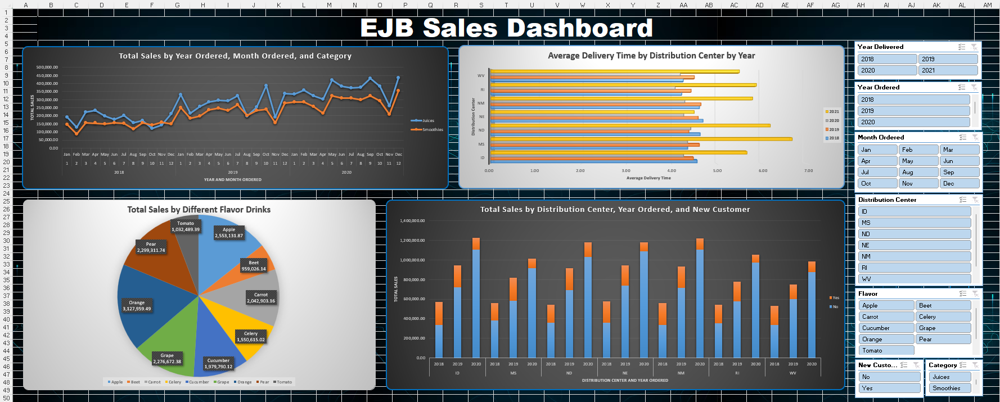
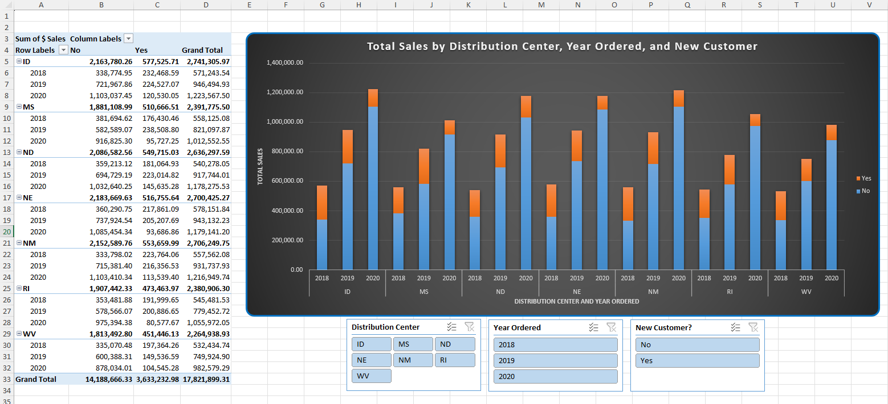
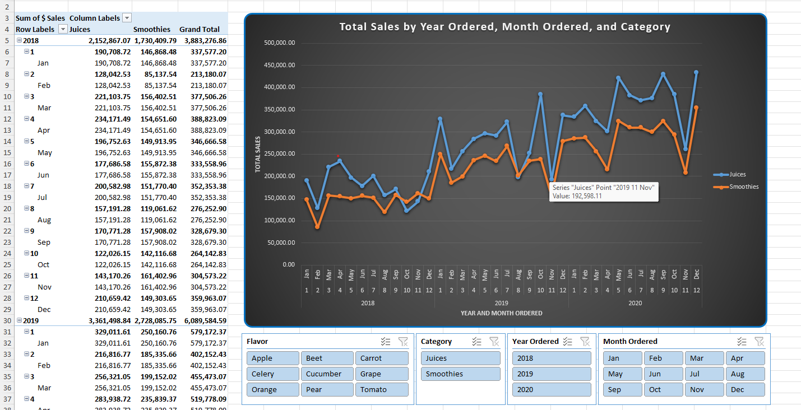
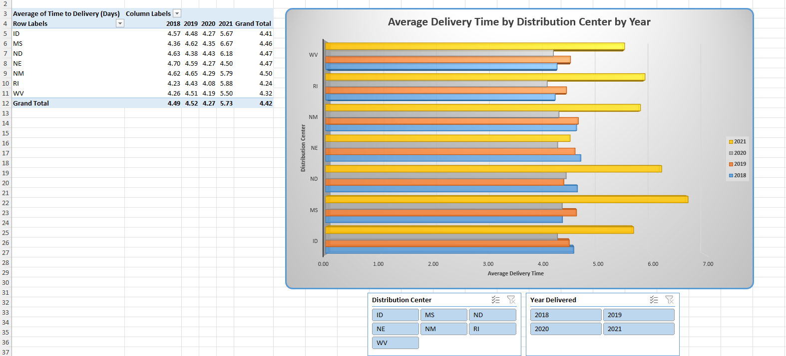
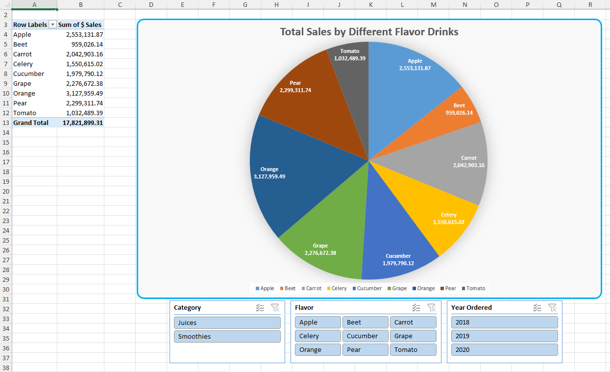

# EJB Sales Dashboard in Excel

## Overview
This project presents an interactive Excel dashboard built for EJB Manufacturing using PivotTables, PivotCharts, and slicers. The dashboard analyzes total sales, product category performance, flavor-level sales, and average delivery time across distribution centers.

## Project Objective
The goal of this project was to apply Excel-based descriptive analytics techniques to a business dataset and build a one-screen interactive dashboard for operational decision-making. The dashboard was designed to help management monitor sales performance, product behavior, and delivery efficiency in real time.

## Business Questions Answered
- How do total sales vary by distribution center, year, and customer type?
- How do product categories perform across months and years?
- Which drink flavors contribute the most to total sales?
- How does delivery time differ across distribution centers over time?

## Tools Used
- Microsoft Excel
- PivotTables
- PivotCharts
- Slicers
- Dashboard formatting and layout design

## Workbook Structure
The Excel workbook contains the following worksheets:

- `SalesByCenter`
- `SalesByProducts`
- `DeliveryTime`
- `SalesByFlavor`
- `Dashboard`

## Key Visualizations

### 1. Sales by Distribution Center
A stacked PivotChart showing total sales by distribution center, year ordered, and new versus existing customer status.

### 2. Sales by Product Category
A line PivotChart showing category-level sales trends across year and month.

### 3. Delivery Performance
A clustered bar PivotChart showing average delivery time by distribution center and year delivered.

### 4. Sales by Flavor
A pie PivotChart showing the contribution of each drink flavor to total sales.

## Dashboard Features
- Interactive slicers
- Real-time filtering
- One-screen executive-style dashboard layout
- Consistent visual design and formatting
- Multiple business views consolidated into one report

## Screenshots

### Dashboard


### Sales by Center


### Sales by Products


### Delivery Time


### Sales by Flavor


## Repository Structure

```text
ejb-sales-dashboard-excel/
├─ README.md
├─ LICENSE
├─ .gitignore
├─ deliverables/
│  └─ Sarosh_Jawed_IS853_Assignment5_EJB_Dashboard.xlsx
├─ docs/
│  ├─ methodology.md
│  └─ screenshots/
│     ├─ dashboard.png
│     ├─ sales-by-center.png
│     ├─ sales-by-products.png
│     ├─ delivery-time.png
│     └─ sales-by-flavor.png
└─ assets/
   └─ cover-image.png
